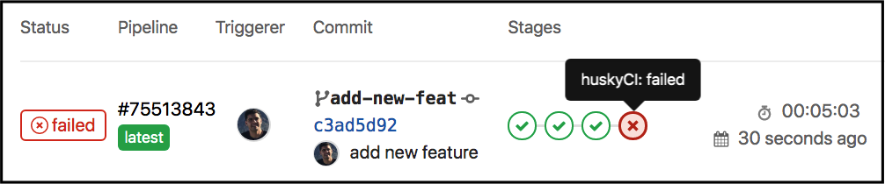

<p align="center">
  
  <!-- logo font: Anton -->
</p>

<p align="center">
  <a href="https://github.com/globocom/huskyCI/releases"></a>
  <a href="https://github.com/rafaveira3/writing-and-presentations/blob/master/DEFCON-27-APP-SEC-VILLAGE-Rafael-Santos-huskyCI-Finding-security-flaws-in-CI-before-deploying-them.pdf"></a>
<a href="https://github.com/rafaveira3/contributions/blob/master/huskyCI-BlackHat-Europe-2019.pdf"></a>
<a href="https://defectdojo.readthedocs.io/en/latest/integrations.html#huskyci-report"></a>
</p>

## Introdução

O huskyCI é uma ferramenta de código aberto que orquestra testes de segurança e centraliza todos os resultados em um banco de dados para análises e métricas posteriores. Ele pode realizar análises de segurança estática em Python ([Bandit][Bandit] e [Safety][Safety]), Ruby ([Brakeman][Brakeman]), JavaScript ([Npm Audit][NpmAudit] e [Yarn Audit][YarnAudit]), Golang ([Gosec][Gosec]), Java ([SpotBugs][SpotBugs] mais [Find Sec Bugs][FindSec]), e HCL ([TFSec][TFSec]). Também pode auditar repositórios em busca de segredos como Chaves Secretas da AWS, Chaves SSH Privadas e muitos outros usando [GitLeaks][Gitleaks].

## Como ele funciona?

Os desenvolvedores podem configurar um novo estágio em seus pipelines de CI para verificar vulnerabilidades:

<p align="center"></p>

Se forem encontrados problemas de segurança no código, informações como a gravidade, a confiança, o arquivo, a linha e muitas outras informações úteis podem ser exibidas, conforme exemplificado:


```
[HUSKYCI][*] poc-python-bandit -> https://github.com/globocom/huskyCI.git
[HUSKYCI][*] huskyCI analysis started! yDS9tb9mdt4QnnyvOBp3eVAXE1nWpTRQ

[HUSKYCI][!] Title: Use of exec detected.
[HUSKYCI][!] Language: Python
[HUSKYCI][!] Tool: Bandit
[HUSKYCI][!] Severity: MEDIUM
[HUSKYCI][!] Confidence: HIGH
[HUSKYCI][!] Details: Use of exec detected.
[HUSKYCI][!] File: ./main.py
[HUSKYCI][!] Line: 7
[HUSKYCI][!] Code:
6
7 exec(command)
8

[HUSKYCI][!] Title: Possible hardcoded password: 'password123!'
[HUSKYCI][!] Language: Python
[HUSKYCI][!] Tool: Bandit
[HUSKYCI][!] Severity: LOW
[HUSKYCI][!] Confidence: MEDIUM
[HUSKYCI][!] Details: Possible hardcoded password: 'password123!'
[HUSKYCI][!] File: ./main.py
[HUSKYCI][!] Line: 1
[HUSKYCI][!] Code:
1 secret = 'password123!'
2
3 password = 'thisisnotapassword' #nohusky
4

[HUSKYCI][SUMMARY] Python -> huskyci/bandit:1.6.2
[HUSKYCI][SUMMARY] High: 0
[HUSKYCI][SUMMARY] Medium: 1
[HUSKYCI][SUMMARY] Low: 1
[HUSKYCI][SUMMARY] NoSecHusky: 1

[HUSKYCI][SUMMARY] Total
[HUSKYCI][SUMMARY] High: 0
[HUSKYCI][SUMMARY] Medium: 1
[HUSKYCI][SUMMARY] Low: 1
[HUSKYCI][SUMMARY] NoSecHusky: 1

[HUSKYCI][*] The following securityTests were executed and no blocking vulnerabilities were found:
[HUSKYCI][*] [huskyci/gitleaks:2.1.0]
[HUSKYCI][*] Some HIGH/MEDIUM issues were found in these securityTests:
[HUSKYCI][*] [huskyci/bandit:1.6.2]
ERROR: Job failed: exit code 190
```

## Primeiros Passos

Você pode experimentar o huskyCI configurando um ambiente local usando o Docker Compose seguindo [este guia](https://huskyci.opensource.globo.com/docs/development/set-up-environment).

## Documentação

Todos os guias e a documentação completa podem ser encontrados na [página oficial de documentação](https://huskyci.opensource.globo.com/docs/quickstart/overview).

## Como contribuir?

Leia nosso [guia de contribuições](https://github.com/globocom/huskyCI/blob/master/CONTRIBUTING.md) para aprender sobre nosso processo de desenvolvimento, como propor correções de bugs e melhorias, e como construir e testar suas mudanças no huskyCI.

## Comunicação

Temos alguns canais de contato, sinta-se à vontade para nos contatar em:

- [GitHub Issues](https://github.com/globocom/huskyCI/issues)
- [Gitter](https://gitter.im/globocom/huskyCI)
- [Twitter](https://twitter.com/huskyCI)

## Contribuições

Este projeto existe graças a todos os [contribuidores]((https://github.com/globocom/huskyCI/graphs/contributors)). Vocês são incríveis!   ❤️🚀

## Licença

O huskyCI está licenciado sob a [Licença BSD 3-Clause "Nova" ou "Revisada"](https://github.com/globocom/huskyCI/blob/master/LICENSE.md).

[Bandit]: https://github.com/PyCQA/bandit
[Safety]: https://github.com/pyupio/safety
[Brakeman]: https://github.com/presidentbeef/brakeman
[Gosec]: https://github.com/securego/gosec
[NpmAudit]: https://docs.npmjs.com/cli/audit
[YarnAudit]: https://yarnpkg.com/lang/en/docs/cli/audit/
[Gitleaks]: https://github.com/zricethezav/gitleaks
[SpotBugs]: https://spotbugs.github.io
[FindSec]: https://find-sec-bugs.github.io
[TFSec]: https://github.com/liamg/tfsec
