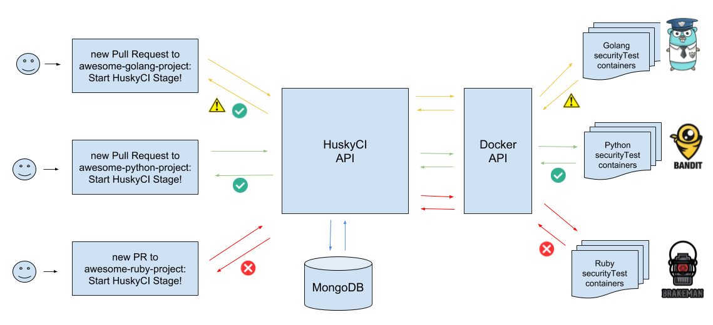

# HuskyCI

[](https://circleci.com/gh/globocom/husky/tree/master)

HuskyCI is an open source tool that performs security tests inside CI pipelines of multiple projects and centralizes all results into a database for further analysis and metrics. The main goal of this project is to help development teams improve the quality of their code by finding vulnerabilities on them as soon as possible.  

## How does it work?

Imagine that an organization has projects like `awesome-golang-project`, `awesome-python-project` and `awesome-ruby-project`. In each of them,  the following example code may be included into each of it's CI configuration file:

```
test-project:
  stage: HuskyCI
  script:
    - wget urlwhereyour.huskyCI.is/huskyci-client
    - chmod +x huskyci-client
    - ./huskyci-client
```

By adding this simple stage on each project, requests will be made to HuskyCI API and it will start analyzing new code submitted via a Pull Request using well-known open source static analysis tools, as shown in the example bellow: 



## Running locally
 
The easiest way to deploy HuskyCI is using Docker Compose, thus, you should have installed [Docker][Docker Install] and [Docker Compose][Docker Compose Install] on your machine. After cloning the repository, just run:

```
make install
```

#### Starting a new analysis:

```
curl -s -H "Content-Type: application/json" -d '{"repositoryURL":"https://github.com/tsuru/cst.git","repositoryBranch":"master"}' http://localhost:8888/husky
```

```
{"RID":"8L85jTJgtuN7o7pRi3sUQ3R4KuCjRcP9","details":"Request received.","result":"ok"}
```

#### Checking analysis status:

```
curl -s localhost:8888/husky/1HQfkskK69LYvLV7rWY03xv03YWoD47T
```

## Contributing

Please read [CONTRIBUTING.md](CONTRIBUTING.md) for details on our code of conduct and the process for submitting pull requests to HuskyCI.


[Docker Install]:  https://docs.docker.com/install/
[Docker Compose Install]: https://docs.docker.com/compose/install/
