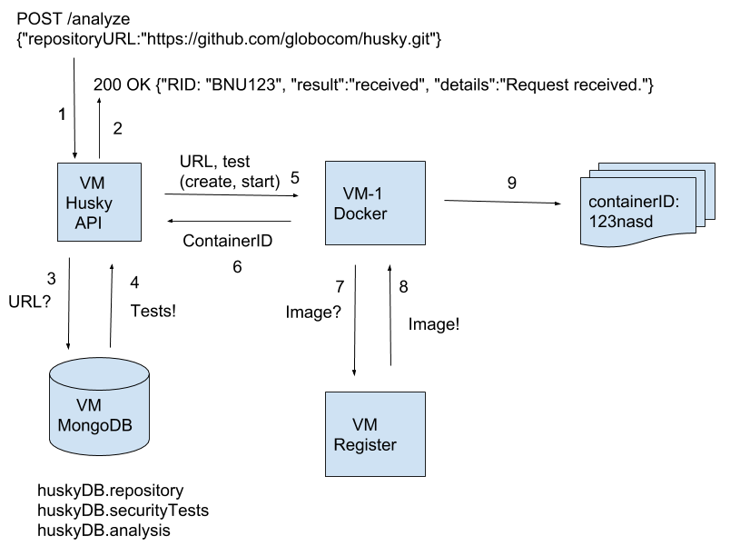
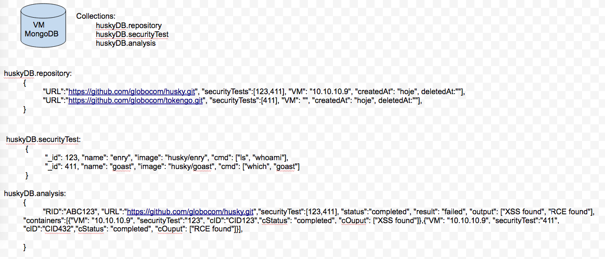

# Husky: Security CI

Husky will make security tests inside a CI.

## Getting Started

These instructions will get you a copy of the project up and running on your local machine for development and testing purposes. See deployment for notes on how to deploy the project on a live system.

### Prerequisites

```
brew install vagrant
```

## Installing

#### Fork Husky's repository:

Fork this repository to your github!

#### Cloning Husky's repository:

```
cd $GOPATH && cd src/ && mkdir github.com && cd github.com && mkdir yourGitHubName && cd yourGitHubName
```

```
git clone https://github.com/yourGitHubName/husky.git && cd husky
```

#### Starting up VMs:

```
vagrant up vm2-db
```

```
vagrant up vm3-docker
```

#### Downloading docker images:

The images below are already installed via Vagrant! These are only some examples on how to download your own docker image if desired.

huskyci/enry:

```
curl -X POST http://192.168.50.6:2376/v1.24/images/create?fromImage=huskyci/enry
```

huskyci/gas:

```
curl -X POST http://192.168.50.6:2376/v1.24/images/create?fromImage=huskyci/gas
```

For more Docker API examples, refer to: https://docs.docker.com/develop/sdk/examples/

#### Setting up environment variables (use your own configuration):

Don't forget to change this password!

```
echo 'export DOCKER_HOST="192.168.50.6:2376"' > .env
echo 'export MONGO_HOST="192.168.50.5"' >> .ev
echo 'export MONGO_NAME="huskyDB"' >> .env
echo 'export MONGO_USER="husky"' >> .env
echo 'export MONGO_PASS="superENVPassword"' >> .env
```

```
source .env
```

#### Inserting new MongoDB user:

```
vagrant ssh vm2-db
```

```
sudo su && mongo
```

```
use huskyDB
```

```
db.createUser({user:"husky", pwd:"superENVPassword", roles: ["readWrite"]})
```

#### Starting Husky:

```
go run server.go
```

#### Adding securityTests:

ENRY:

```
curl -H "Content-Type: application/json" -d '{"name":"enry", "image": "huskyci/enry", "cmd": "echo [ENRY]; git clone %GIT_REPO% code; cd code; enry --json" , "language": "Generic", "default":true}' http://localhost:9999/securitytest
```

GAS:

```
curl -H "Content-Type: application/json" -d '{"name":"enry", "image": "huskyci/enry", "cmd": "echo [GAS]; cd src; git clone %GIT_REPO% code; cd code; /go/bin/gas -fmt=json -log=log.txt -out=results.json ./... ; cat results.json" , "language": "Go", "default":true}' http://localhost:9999/securitytest
```


#### Adding new repository example:


```
curl -H "Content-Type: application/json" -d '{"repositoryURL":"https://github.com/tsuru/cst.git", "securityTestName":["gas"]}' http://localhost:9999/repository 
```

```
{"RID":"eZVxfYH7W6XOdjuQbNV5I7l5XJ8puTUo","details":"Request received.","result":"ok"}
```

#### Checking analysis status:

```
curl -s localhost:9999/husky/eZVxfYH7W6XOdjuQbNV5I7l5XJ8puTUo
```

```
{"ID":"5b4c9795a118cc8f953f2042","RID":"CQsXAjvgVwtKVfUarkCDgHJoZpEI3kz9","URL":"https://github.com/tsuru/cst.git","securityTests":[{"ID":"5b470d9c3406984e4b27009d","name":"gas","image":"huskyci/gas","cmd":"echo -n [GAS]; cd src; git clone %GIT_REPO% code; cd code; /go/bin/gas -quiet -fmt=json -log=log.txt -out=results.json ./... ; cat results.json","language":"Generic","default":true}],"status":"started","result":"","containers":[{"CID":"f0fb8ae1c5edd4fed8a62a4554be3d57804e4803b872b762f58af10d94b226e7","VM":"","securityTest":{"ID":"5b470d9c3406984e4b27009d","name":"gas","image":"huskyci/gas","cmd":"echo -n [GAS]; cd src; git clone %GIT_REPO% code; cd code; /go/bin/gas -quiet -fmt=json -log=log.txt -out=results.json ./... ; cat results.json","language":"Generic","default":true},"cStatus":"finished","cOutput":"\u0001\u0000\u0000\u0000\u0000\u0000\u0000\u0005[GAS]","cResult":"","startedAt":"2018-07-16T10:03:18.515-03:00","finishedAt":"2018-07-16T10:03:21.958-03:00"}]}
```

## Architecture draft



## MongoDB draft



